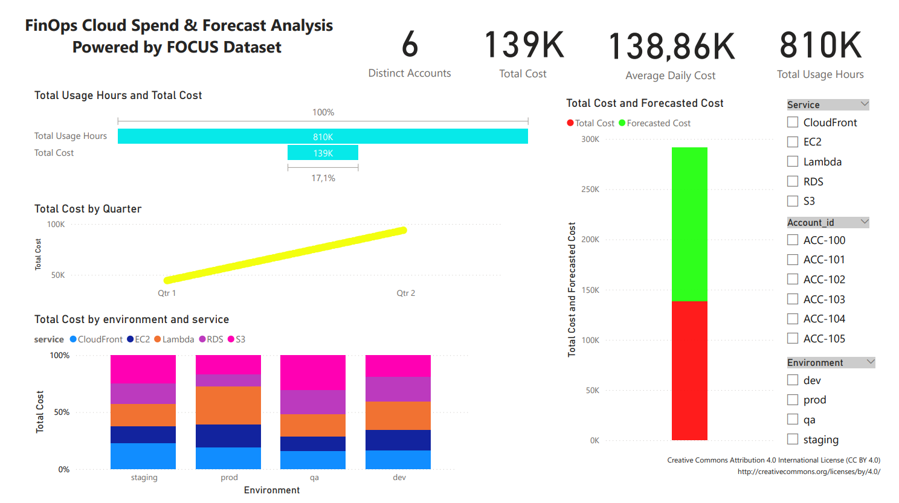

# FinOps Cloud Spend & Forecast Analysis – Powered by FOCUS Dataset

This project analyzes cloud cost data using the [FOCUS Dataset](https://focus.finops.org/sandbox), a standardized data model from the FinOps Foundation designed to simulate public cloud spend scenarios.

## 📊 Dashboard Overview

The dashboard was built using Power BI and includes:

- **Actual vs Forecasted Cloud Spend**
- **Cost breakdown by service, environment, and account**
- **Usage hours vs total cost**
- **Quarterly trends in cloud expenses**
- **Interactive filters** (Service, Account ID, Environment)

---

## 🔧 Tools Used

- [Power BI](https://powerbi.microsoft.com/)
- [FOCUS Sandbox Dataset](https://focus.finops.org/sandbox)
- [GitHub](https://github.com/)

---

## 📁 Data Source

The dataset used in this project was extracted from the official FinOps sandbox:  
🔗 [https://focus.finops.org/sandbox](https://focus.finops.org/sandbox)

Hosted on GitHub:  
📦 [https://github.com/mike-finopsorg/focus-demo-data](https://github.com/mike-finopsorg/focus-demo-data)

---

## 🧩 Power BI Template File (.pbit)
You can download the Power BI template file and explore all queries, measures, and report structure:
<a href="https://raw.githubusercontent.com/izadorasobral/FinOps-Cloud-Spend-Forecast-Analysis-/main/Cloud%20Cost%20Optimization%20Dashboard.pbit" download>Baixar Power BI Template</a>
---

## 📚 What I Learned

- How to analyze real-world-like cloud spend data
- Comparing forecasted vs actual costs
- Applying FinOps principles to dashboard design
- Creating business-oriented KPIs and interactive visual reports

---

## 📌 About the Author

Hi, I'm **Izadora Sobral**, a Data Science student passionate about **Cloud Computing** and **FinOps**.  
My goal is to build a career focused on cloud cost optimization, automation, and financial governance in cloud environments.

Let’s connect on [LinkedIn](https://www.linkedin.com/in/izadora-sobral).

---

## 🔗 License

This project is shared under the **Creative Commons Attribution 4.0 International License**  
📖 [CC BY 4.0](https://creativecommons.org/licenses/by/4.0/)

> Inspired by the open dataset initiative from the [FinOps Foundation](https://www.finops.org/).

